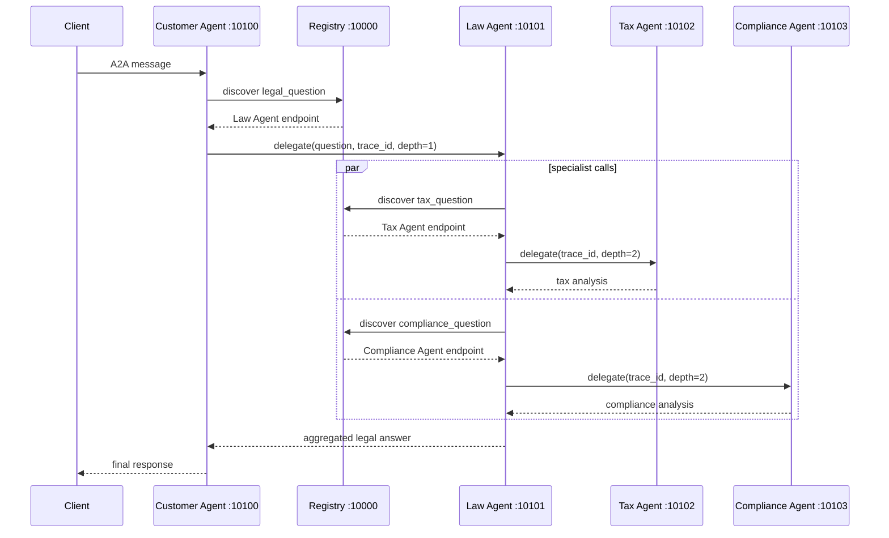

# Bai lam tu Task 4 den het

## Task 4

- Da them `privacy_agent` chuyen phan tich GDPR va luat bao ve du lieu ca nhan.
- Router chi goi cac chuyen gia khi cau hoi chua tu khoa phu hop.
- Tax, compliance va privacy agent duoc dispatch song song bang `Send`.
- Ket qua privacy duoc dua vao node `aggregate`.

## Task 5.1 - Trace request flow

`trace_id` duoc tao tai Customer Agent va truyen xuyen suot cac lan delegate.

## Task 5.2 - Dynamic discovery

Khi dung Tax Agent, Registry co the van giu registration cu nen Law Agent discover
duoc endpoint nhung ket noi se that bai. `call_tax` bat exception va tra ve
`[Tax analysis unavailable: ...]`; cac nhanh con lai van tiep tuc, nen he thong
tra loi theo degraded mode thay vi lam hong toan bo request.

## Task 5.3 - Modify agent behavior

Da sua `tax_agent/graph.py`: Tax Agent tra loi toi da 150 tu, tap trung vao trach
nhiem, muc phat, co quan lien quan va hanh dong can lam ngay.

## Cau hoi on tap

1. Dung single agent khi bai toan hep, it cong cu, khong can chuyen mon doc lap
   hoac chay song song. Multi-agent phu hop khi can tach domain, scale va fault isolation.
2. A2A bo sung discovery, Agent Card, task/message/artifact va semantics cong tac
   agent. REST/gRPC chu yeu la co che van chuyen.
3. Gioi han `delegation_depth`, truyen trace/context, phat hien agent da di qua,
   gioi han thoi gian/so buoc va tu choi delegation khi vuot nguong.
4. Registry ho tro dynamic discovery va thay endpoint ma khong sua client. Hardcode
   URL phu hop demo nho nhung kho scale, failover va trien khai nhieu moi truong.

## Bai cong diem - Latency

`test_client.py` da duoc bo sung do thoi gian bang `time.perf_counter()` va in
`LATENCY` sau moi request.

Phuong an giam latency da ap dung:

- Law Agent goi Tax va Compliance Agent song song bang `Send`.
- Chi goi specialist can thiet thong qua conditional routing.
- Rut gon Tax Agent output xuong toi da 150 tu de giam thoi gian sinh token.

De lay so lieu truoc/sau dang tin cay, chay cung mot cau hoi it nhat 5 lan cho moi
phien ban, bo lan warm-up dau tien va so sanh median latency. So lieu thuc te phu
thuoc model, OpenRouter va mang tai thoi diem chay.
